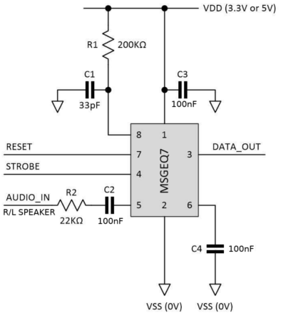
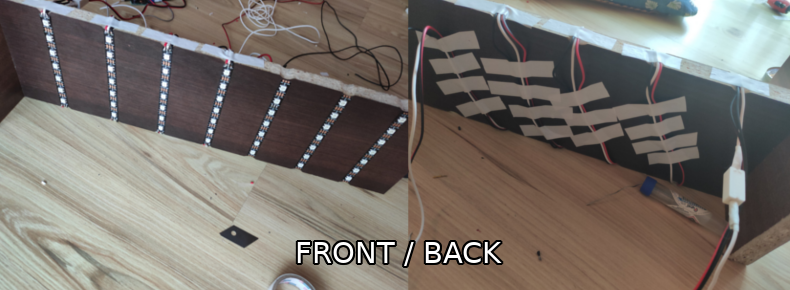

# Audio Spectrum Visualizer
Hello everyone!
I would like to show you my 'Audio Spectrum Visualizer' which I created for my father. It's a seven-band version, one per speaker. This project was made to improve my electronics skill. Besides, we like good sound very much. All informations and photos can be seen below (or in the datasheet):

--------------------------------------------------------------------------------------------------------------------
*FINISH EFFECT (without sound and night)*

--------------------------------------------------------------------------------------------------------------------
*FINISH EFFECT (with sound and night)*

youtube link will be here.

--------------------------------------------------------------------------------------------------------------------
*USED ELEMENTS*

- 2x MSGEQ7
- 4x 22k resistors
- 2x 200k resistors
- 2x 470 resistors
- 6x 100nF capacitors
- 2x 33pF capacitors  
   

- 2x 60leds/m WS2812b led strips
- 12V/5A power supply
- 12V/5A -> 5V/5A converter  
   

- SONOFF BASIC R3 (to turn on the extension cord via wifi)
- Extension cord

--------------------------------------------------------------------------------------------------------------------
*INSTALLATION*  

--------------------------------------------------------------------------------------------------------------------

